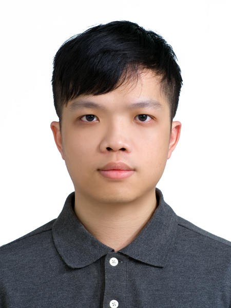

# 我的個人簡介

I graduated with a bachelor's degree from the Department of Information Management at Pingtung University of Science and Technology in 2018. I also obtained my master's degree from the same department in 2020.

My main interests focus on computer vision and machine/deep learning, as well as the applications of medical imaging and natural language processing.

From September 2020 to November 2022, I served as a master's researcher at Chang Gung Medical Foundation Hospital. My primary research project was the task of stroke image recognition in MRI images, which has been completed and published in NeuroImage: Clinical. Since December 2022, I have been working as a master's researcher at Far Eastern Memorial Hospital and National Cheng Kung University, focusing on the research topics of satellite HSI transmission tasks and natural language applications in electronic medical records. The aforementioned studies have been published in ACM and IEEE: TGRS. For work projects not mentioned, please refer to my Github.

Over the years, along with my team, I have won several significant challenges at top conferences and published papers in journals such as IEEE ICASSP and IEEE VCIP. For instance, we secured third place in the Learning to Drive Challenge at the IEEE International Conference on Computer Vision (ICCV) and first place in the COV19D Challenge.
## 目錄

- [個人資歷](#個人資歷)
- [擅長技能](#擅長技能)
- [相關網站](#相關網站)
- [聯絡方式](#聯絡方式)

## 個人資歷
- **教育背景**
  <!-- - 學校名稱，學位，專業，年份 -->
- **工作經歷**
  <!-- - 公司名稱，職位，年份 -->
- **專案經驗**
  <!-- - 簡要描述你參與的專案和取得的成果 -->

## 擅長技能
- **程式語言**
  - Python
- **Tools&Skills**
  - Git
  - Linux (Ubuntu)

## 相關網站
- [LinkedIn](https://www.linkedin.com/in/chihyujiantw)

## 聯絡方式

- **電子郵件**：ru0354m3@gmail.com
- **手機號碼**：+886-970-787-419
